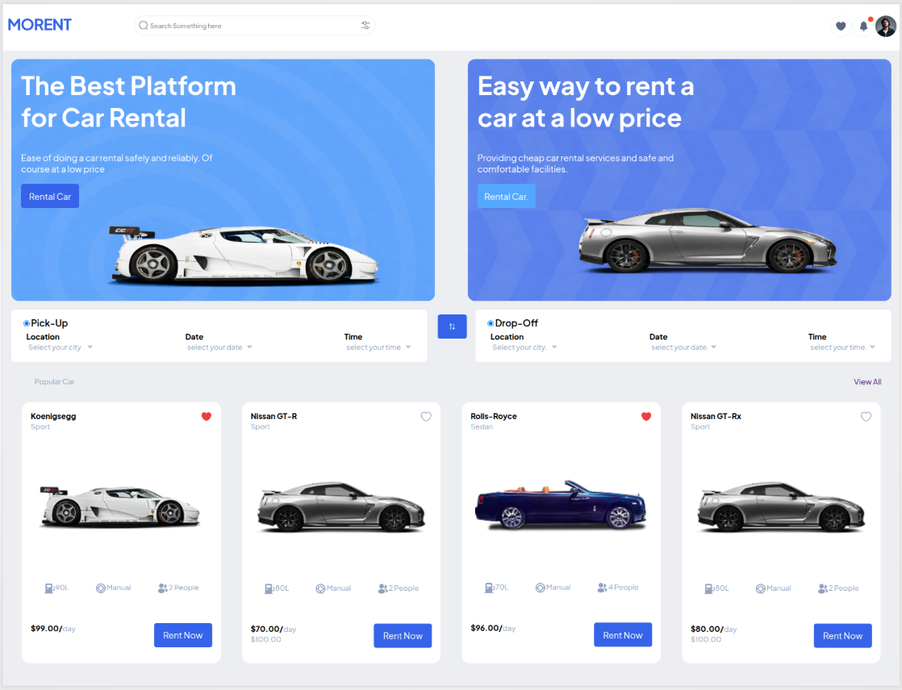
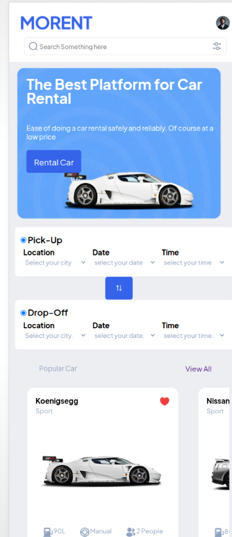

# Morent Car Rent
This is a Car Rent site created using **HTML** and **CSS** given by our teachers at **Rebase Code Camp**. It was a figma project to be change to a site using HTML and CSS only. It was an amazing and inpiring project. I learned a lot of stuff while building the project because I met things I haven't done before but because of research using w3school other platforms I succeeded to do it.

---

## Preview and How to use
(open `index.html` or the deployed link to view whitepace site)
- Deployed link: [https://komoforbrandon.github.io/Morent-car-rent/]

## Folder Structure
```text
.Morent-car-rent
|___asssets/image/all images
|___styles/style.css
|____index.html

```
## Example Output of the Whitepace site
This is Desktop view


This is Mobile view



---

## Built with
- HTML
- CSS
- with IDE VS Code

---

## Features
- Clean and simple layout
- A clean design
- Car name with the car image
- Each car with the rent price
- Responsive design
- A good header

---

## Author
- Name: **Komofor Brandon**
- Github: [https://github.com/komoforbrandon]

---

## Acknowledgements
- Inpiration from **Rebase Code Camp** and my teachers **Madam Faith and Vanessa**